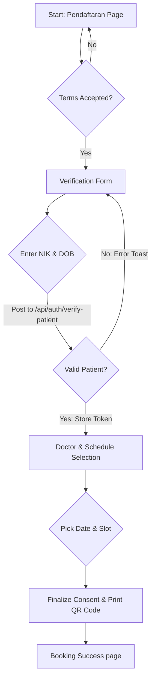

# RS Bhayangkara Nganjuk — Frontend Product Requirements Document (PRD) & Core Memory

> **System Role & Purpose:** This file serves as the absolute source of truth for the **RS Bhayangkara Nganjuk Website Frontend**. It represents a shared understanding established between the programmer and the AI coding assistant (Antigravity). All future frontend modifications, features, and refactoring efforts must strictly conform to the specifications and design system principles outlined herein.

---

## 1. Project Context & Vision

RS Bhayangkara Nganjuk is a premier healthcare institution in Nganjuk, East Java. The public website's frontend serves as a premium, secure, and accessible portal for patients, medical staff, and visitors. The primary objective is to deliver a world-class, distraction-free user experience that facilitates rapid medical schedule verification, trusted hospital branding representation, and seamless online pre-registration.

*   **Technology Stack:** Next.js 16.2.2 (React 19, Tailwind CSS v4, Base UI, Lucide Icons, Sonner Toasting)
*   **Target Audience:** Patients seeking treatment (new & returning), families, medical practitioners, and administrators.
*   **Design Archetype:** Minimalist, trustworthy, and distraction-free, featuring an **Azure Blue** healthcare color identity.

---

## 2. Global Design System (Azure Blue Medical)

All visual elements, layout structures, and components must adhere to the Master Design System rules to ensure a harmonious, highly trustworthy hospital atmosphere.

### 2.1 The Color Palette
The colors are meticulously selected for maximum medical authority, accessibility compliance (WCAG AAA), and aesthetic premium quality.

| Role | HEX Code | CSS Token Name | Purpose / Application |
| :--- | :--- | :--- | :--- |
| **Primary Deep** | `#042C53` | `--color-primary-900` | Deep navy background for navigation bar, footer, and dark hero layouts. |
| **Primary Dark** | `#0C447C` | `--color-primary-800` | Hover states on dark elements, secondary hero panel accents. |
| **Primary Brand** | `#185FA5` | `--color-primary-600` | Core brand blue: main call-to-actions (CTA), interactive link colors, active borders. |
| **Primary Active** | `#378ADD` | `--color-primary-400` | Primary buttons, active state badges, interactive highlights. |
| **Primary Muted** | `#85B7EB` | `--color-primary-200` | Secondary text, placeholders, and descriptions on dark backgrounds. |
| **Primary Border** | `#B5D4F4` | `--color-primary-100` | Borders on dark surfaces, divider lines on dark background sections. |
| **Primary Light BG** | `#E6F1FB` | `--color-primary-50` | Accent background chips, icon container panels, light inputs. |
| **Accent Success** | `#1D9E75` | `--color-accent-teal` | Active doctor status indicator, success notices, valid slot badges. |
| **Accent Success BG**| `#E1F5EE` | `--color-accent-teal-light` | Soft background for success alerts or active patient slots. |
| **Accent Danger** | `#E24B4A` | `--color-danger` | IGD Urgent alerts, error highlights, fully-booked slot indications. |
| **Neutral Background**| `#F1EFE8` | `--color-neutral-50` | Global page container background (warm, clinical gray). |
| **Neutral Border** | `#D3D1C7` | `--color-neutral-200` | Default subtle borders for cards, inputs, and layout blocks. |
| **Neutral Muted Text**| `#5F5E5A` | `--color-neutral-600` | Subtitles, disabled helper text, secondary descriptions. |
| **Neutral Body Text** | `#2C2C2A` | `--color-neutral-900` | High-contrast main content body text (4.5:1 minimum AA). |

### 2.2 Typography
*   **Headings (H1, H2, H3, H4, H5, H6):** **Figtree** (`var(--font-figtree)`). Displaying a modern, highly legible, geometric sans-serif aesthetic with bold letter weights.
*   **Body Content & Labels:** **Inter** (`var(--font-inter)` / system body) with a fallback to **Noto Sans**. Ensures absolute legibility for dense patient details and small screen formats.
*   **CSS Variable Imports (Next.js font loader optimization):**
    ```javascript
    import { Inter, Figtree } from 'next/font/google';
    const inter = Inter({ subsets: ['latin'], variable: '--font-inter', display: 'swap' });
    const figtree = Figtree({ subsets: ['latin'], variable: '--font-figtree', display: 'swap' });
    ```

### 2.3 Interactive Aesthetics & Forbidden Anti-Patterns (CRITICAL)
*   **❌ No AI Gradients:** Under no circumstances should pink, purple, or futuristic neon-green gradients be used.
*   **❌ Emojis Forbidden in Structure:** Never use raw emojis as UI icons. Always use SVG icons (specifically **Lucide React** or custom SVGs mapped to the theme).
*   **❌ No Layout-Shifting Hovers:** Card hovers must use controlled offsets (`translateY(-2px)` max). Scale enlargements that alter document flow are prohibited.
*   **❌ Instant State Changes Prohibited:** Interactive states (hover, focus, active, select) must always feature smooth transition durations (`150ms` to `300ms`) with cubic-bezier timing.
*   **Focus Outline Standard:** Keyboard navigation must be clear. Focus rings must implement:
    ```css
    :focus-visible {
      outline: 2.5px solid var(--color-primary-400);
      outline-offset: 2px;
      border-radius: 4px;
    }
    ```

---

## 3. Minimalist Layout & Distraction-Free UX

To achieve a premium, distraction-free aesthetic, the landing page layout is kept clean, prioritizing visual excellence and immediate clarity.

1.  **Distraction-Free Landing Page:**
    *   **No Floating Action Buttons (FAB):** Floating support bubbles, persistent chat helpers, and IGD hotline badges are entirely removed. This removes clutter and prevents visual fatigue.
    *   **IGD Hotline & Booking Support:** Positioned clearly, structured elegantly, and stored strictly in the **Footer** to maintain page-wide visual calm.
    *   **Hero Call-To-Action (CTA):** All primary conversion items (e.g., Booking Jadwal Dokter, Pendaftaran Online) are localized inside the **Hero Section** above-the-fold.
2.  **Standard Page Section Sequence:**
    ```
    Hero Section (CTAs) ➔ ServiceGrid (Layanan Unggulan) ➔ DoctorPreview ➔ SchedulePreview ➔ TestimonialSection ➔ FAQSection ➔ PartnerSection ➔ NewsPreview ➔ Footer (Contact Hub)
    ```
3.  **Scroll Reveal Animations:**
    *   All sections below the fold are wrapped in `<ScrollReveal>` client-side wrappers.
    *   Variants: `fade-up`, `fade-left`, `fade-right`, and `zoom`.
    *   All animations respects `prefers-reduced-motion` settings via globals.css media queries.

---

## 4. Online Pre-Registration Architecture (Pasien Lama)

The patient pre-registration workflow is a critical operational bridge. It implements a secure, state-persistent multi-step Wizard layout.



### 4.1 Secure Sequential Session Validation
To prevent unauthorized API attempts or deep linking bypasses:
1.  **Terms Acceptance Requirement:** The patient must review and checkbox-agree to the Consent Terms. Submitting this forms creates a dynamic `consent_id` on the NestJS backend and saves it in `sessionStorage.setItem('consent_id', id)`.
2.  **Protected Page Guards:** Client-side router guards block access to `/pendaftaran/lama` if `consent_id` is missing in `sessionStorage`.
3.  **Secure NIK Verification:** NIK and Date of Birth are securely dispatched to the NestJS backend endpoint (`POST /auth/verify-patient` or equivalent). Success returns a short-lived, encrypted transaction token stored in memory/sessionStorage.
4.  **Doctor Selection Guard:** The doctor schedule selection screen will NOT load unless the active session token exists, preventing users from forging booking data.

### 4.2 Resilient Form State Persistence (Wizard Auto-Save)
To counter accidental tab closes, network drops, or page reloads, a robust form recovery mechanism is mandated:
*   All user input fields (selected doctor, target schedule date, poli choices, personal metadata) are continuously serialized and committed to `sessionStorage` under the namespace `nganjuk_registration_draft`.
*   On component mount, the form checks for the presence of this key. If found, it populates all fields automatically, allowing the user to seamlessly resume from exactly where they left off.
*   Once a booking is finalized and the success QR Code page loads, the system explicitly clears `nganjuk_registration_draft` to prevent caching stale entries for subsequent sessions.

---

## 5. API Integration & Caching Strategy

The frontend coordinates high-performance, robust data pipelines connecting to the NestJS Backend (`/api/v1`).

```
Next.js Frontend (RSC + Actions) ➔ Next API Middleware Client ➔ NestJS Backend v1 ➔ MySQL (SIMRS / BIOS logs)
```

To optimize server loading speeds while maintaining data accuracy, the frontend operates a **Hybrid Caching Strategy**:

### 5.1 Dynamic Rendering (`'no-store'`)
High-frequency, real-time datasets must never be cached. They use strict dynamic server-side fetches:
*   **Jadwal Dokter & Doctor Availability:** Ensures real-time slot limits, active/on-duty markers, and temporary leave statuses are fully accurate.
*   **Pendaftaran & Verification Logs:** Immediate transaction processing prevents concurrency overlaps (e.g., two patients selecting the exact same slot simultaneously).
*   **Code Enforcement:**
    ```javascript
    export const dynamic = 'force-dynamic';
    // or inside fetch requests:
    const res = await fetch(url, { cache: 'no-store' });
    ```

### 5.2 Smart Caching & Incremental Revalidation (`revalidate: 3600`)
Stable promotional, profile, and FAQ content is cached statically and revalidated every hour:
*   **About Profile, Milestones, and Visi-Misi:** Static content rarely updated.
*   **Mitra & Asuransi (Partners):** Rendered on the landing page, revalidated on a 60-minute cycle.
*   **FAQ List & Layanan (Services):** Revalidated every 3600 seconds.
*   **Code Enforcement:**
    ```javascript
    const res = await fetch(url, { next: { revalidate: 3600 } });
    ```

---

## 6. SEO & Accessibility (a11y) Checklists

RS Bhayangkara Nganjuk is committed to digital inclusivity and high search engine visibility.

### 6.1 SEO Strategy & Semantic Markup
*   **Title Template & Meta Descriptions:** Implement unique page-specific HTML metadata headers.
*   **Schema.org Structured Data:** Inject highly specific JSON-LD structures for local healthcare crawlers on the Landing Page:
    *   `MedicalOrganization` + `Hospital`: Documents official name, logo, geolocation ( Kauman, Nganjuk), coordinates, bed counts, emergency contact (+62 812-1683-1605), and service classifications.
    *   `WebSite` with Sitelinks Searchbox properties to optimize Google Search appearance.
*   **Heading Structure:** Exactly one `<h1>` per page. Strict, nested heading hierarchy (`h1` ➔ `h2` ➔ `h3` ➔ `h4`) without jumping levels.
*   **Dynamic Sitemap & Robots:** Fully configured sitemaps listing all routing patterns (`/about`, `/doctors`, `/schedule`, `/faq`, `/news`, `/pendaftaran`).

### 6.2 Accessibility (a11y) Guidelines
*   **Interactive Target Sizing:** All buttons, anchor tags, and custom inputs must have a touch footprint of at least **44x44px** to cater to mobile patients or users with motor dexterity difficulties.
*   **Screen Reader Optimization:**
    *   All images are required to feature descriptive `alt` attributes.
    *   Every section must be wrapped in semantic HTML5 elements (`<section>`, `<nav>`, `<main>`, `<article>`) and annotated with `aria-labelledby` linking directly to the respective section's `<h2>`.
*   **Reduced Motion Support:** A global media query blocks all animations if preferred by the client operating system:
    ```css
    @media (prefers-reduced-motion: reduce) {
      .sr-base, .reveal {
        opacity: 1 !important;
        transform: none !important;
        transition: none !important;
      }
    }
    ```
*   **Focus Skip Links:** Include a hidden `"Skip to Content"` skip-link targeting the main article body directly behind the navbar, enabling keyboard-only users to bypass layout navigations rapidly:
    ```html
    <a href="#main-content" className="skip-link">Lompat ke Konten Utama</a>
    ```

---

## 7. Frontend Pre-Delivery Checklist
Before submitting any new feature, layout tweak, or routing update to production:

*   [ ] **Design Compliance:** Verify that color palettes strictly map to Azure Blue CSS variables. Ensure no hot-pink or generic colors exist.
*   [ ] **Icon Consistency:** Verify all icons originate from the `Lucide React` SVG library. No raw emojis.
*   [ ] **Cursor Pointer:** Assert that `cursor: pointer` is applied to all clickable elements.
*   [ ] **Transitions:** Verify hover states utilize smooth `transition` intervals (150ms-300ms).
*   [ ] **A11y Touch Target:** Ensure all buttons/inputs are at least 44x44px.
*   [ ] **A11y Focus States:** Verify keyboard tab flows display high-visibility focus rings.
*   [ ] **RSC Caching Rules:** Ensure Jadwal and Pendaftaran utilize `cache: 'no-store'` or `force-dynamic`, while About/FAQ/Partners utilize `revalidate: 3600`.
*   [ ] **Responsive Testing:** Validate layout looks premium across breakpoints: 375px (mobile), 768px (tablet), 1024px (desktop), and 1440px (wide).
*   [ ] **No Horizontal Scroll:** Ensure no container overflows the window boundary on mobile devices.
*   [ ] **Wizard Persistence:** Ensure `sessionStorage` stores active inputs for NIK booking flows, restoring draft values correctly upon browser refresh.

---
*Document Version: 1.1.0*
*Established by developers of RS Bhayangkara Nganjuk.*
